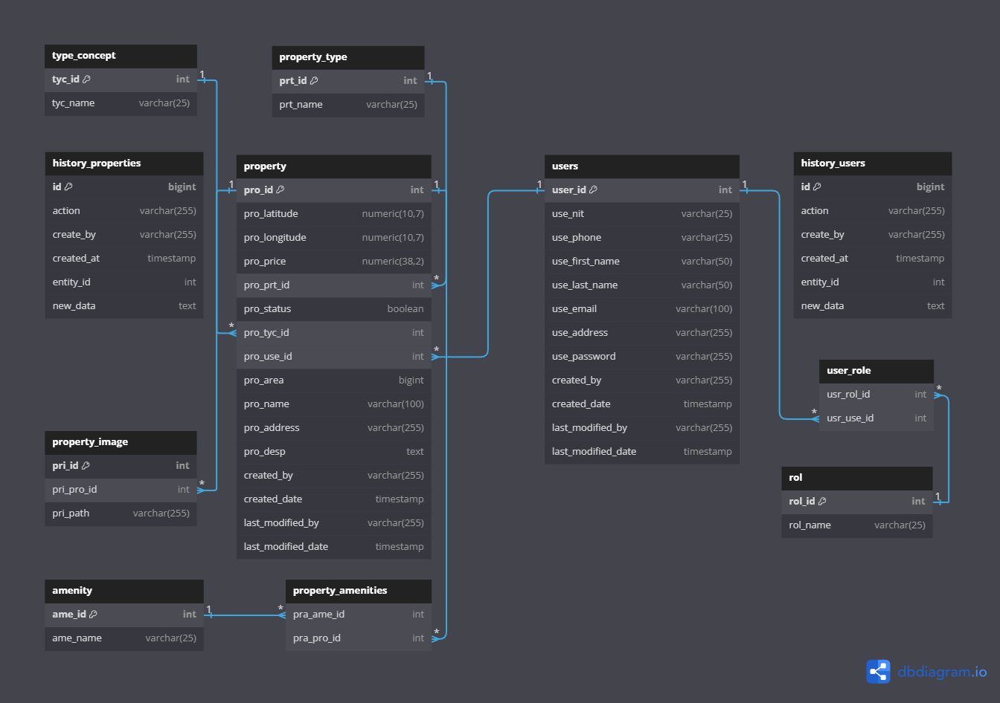

# HomeChoice API
The backend service for the HomeChoice real estate management system. This service is built with Spring Boot and provides functionalities to manage properties, users, and roles within a real estate agency. It includes a hierarchical role-based access control (RBAC) system to manage user permissions and resource access.

## Technologies Used
- **Spring Boot**: Framework for building the application.
- **PostgreSQL**: Relational database for data persistence.
- **Spring Security**: For authentication and authorization.
- **JWT (JSON Web Tokens)**: For secure token-based authentication.
- **JavaDocs**: For documentation.
- **JPA/Hibernate**: For database access.

## Model ER


## Folder Structure
```
src/
 └── main/
     ├── java/
     │   └── com/
     │       └── homechoice/
     │           ├── audit/                         // Audit module for tracking changes.
     │           │   ├── config/                    // Configuration classes for audit.
     │           │   ├── model/                     // Entities for audit logging.
     │           │   ├── repository/                // Interfaces for audit data access.
     │           │   ├── service/                   // Services for handling audit logic.
     │           │   └── util/                      // Utility classes for audit.
     │           ├── aws/                           // AWS integrations (e.g., S3 Bucket).
     │           ├── controller/                    // API controllers (endpoints).
     │           │   ├── property/                  // Controllers for property-related endpoints.
     │           │   │   └── auxiliary/             // Auxiliary controllers for property.
     │           │   └── user/                      // Controllers for user-related endpoints.
     │           │       └── auxiliary/             // Auxiliary controllers for user.
     │           ├── dto/                           // Data Transfer Objects for data transfer.
     │           │   ├── property/                  // DTOs related to properties.
     │           │   └── user/                      // DTOs related to users.
     │           ├── exception/                     // Central exception handling.
     │           ├── model/                         // Data model entities (database tables).
     │           │   ├── property/                  // Entities related to properties.
     │           │   └── user/                      // Entities related to users.
     │           ├── repository/                    // Database interaction interfaces (JpaRepository).
     │           │   ├── property/                  // Repositories for property-related data.
     │           │   └── user/                      // Repositories for user-related data.
     │           ├── security/                      // Security configurations and authentication.
     │           │   ├── auth/                      // Authentication-related classes.
     │           │   ├── config/                    // Security configuration classes.
     │           │   └── jwt/                       // JWT token handling classes.
     │           └── service/                       // Business logic of the application.
     │               ├── property/                  // Services for property-related logic.
     │               │   └── auxiliary/             // Auxiliary services for property.
     │               └── user/                      // Services for user-related logic.
     │                   └── auxiliary/             // Auxiliary services for user.
     └── resources/                                 // Configuration files and static resources.
         └── static/
             └── docs/
                 └── javadoc/                       // Folder where Javadoc-generated documentation should be placed.
```
> [!TIP]
> To properly configure the environment variables, ensure you have a `.env` file located in the `resources` directory of your project. This file should contain all necessary environment-specific configurations for the application to function correctly.

## Documentation
The API is documented with Javadocs. To view the documentation, you need to compile the Javadocs and choose the output directory. Once compiled, you can access the documentation from the generated output directory in your browser.

> [!WARNING]
> Due to compilation issues with Javadocs, the annotation `@RequiredArgsConstructor(onConstructor_ = @__(@Lazy))` should be replaced with `@Lazy` explicitly.

## Contributing
Contributions are welcome! Please follow these steps:

1. Fork the repository.
2. Create a new branch (`git checkout -b feature/YourFeature`).
3. Commit your changes (`git commit -m 'Add some feature'`).
4. Push to the branch (`git push origin feature/YourFeature`).
5. Open a pull request.
